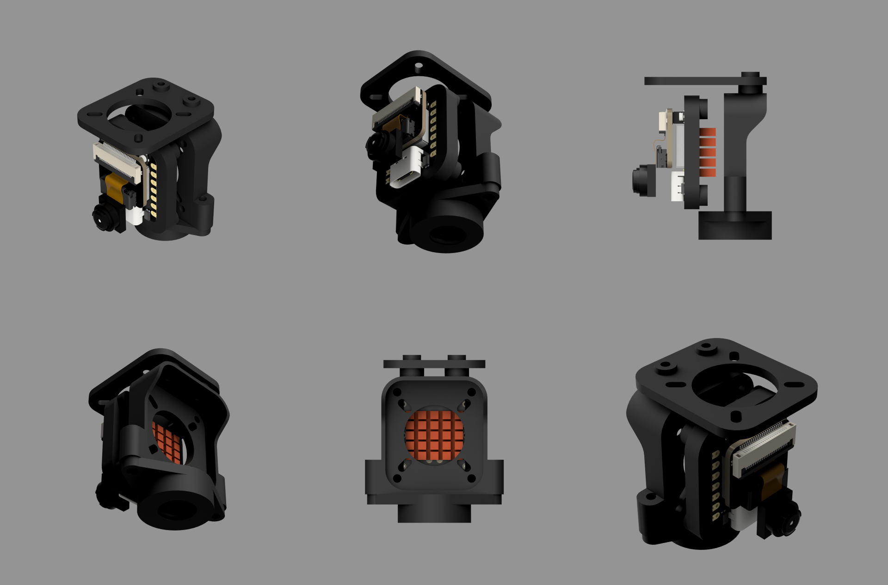

# EI_ESP32_CAM_SERVER

| Repo | CI status |
| --- | --- |
| CI on [dattazigzag repo](https://github.com/dattazigzag/EI_ESP32_CAM_SERVER) | [](https://github.com/dattazigzag/EI_ESP32_CAM_SERVER/actions/workflows/arduino-ci.yml) |
| CI on [dattasaurabh82 repo](https://github.com/dattasaurabh82/EI_ESP32_CAM_SERVER) | [](https://github.com/dattasaurabh82/EI_ESP32_CAM_SERVER/actions/workflows/arduino-ci.yml) |


<!-- Arduino CI on dattazigzag repo: [](https://github.com/dattazigzag/EI_ESP32_CAM_SERVER/actions/workflows/arduino-ci.yml)

Arduino CI on dattasaurabh82 repo:[](https://github.com/dattasaurabh82/EI_ESP32_CAM_SERVER/actions/workflows/arduino-ci.yml) -->

## What is this?

This educational tool helps reduce the time needed for capturing and labeling ESP32 camera images for TinyML training in [edgeimpulse](https://docs.edgeimpulse.com/reference). It's more efficient than the standard method of capturing and uploading single images through the [edgeimpulse data forwarder firmware](https://github.com/edgeimpulse/firmware-espressif-esp32).

Instead, it creates an MJPEG stream directly from the camera and displays it on a camera-hosted frontend. This allows you to capture, label, and bulk upload images to the edgeimpulse studio—making the process more efficient than sitting there for a long time doing it manually.

---
## ToDo - WIP

- [x] Stabilize Stream
- [x] Optimize Capture frame
- [x] Integrate edge impulse upload API
- [x] Button to Start Stop Stream But still retain snapshot (currently it's always streaming)
- [x] Add button and counter option for automatic capture at certain delays
- [x] Persistant saving of EI config in LittleFS.
- [x] Check detecting a Project's `Set Labelling Method`](https://forum.edgeimpulse.com/t/is-there-an-api-end-point-to-get-projects-set-labelling-method/13292?u=dattasaurabh82) and set it correctly for image upload
- [x] Beautify a bit
- [x] Add Footer
- [x] Implement actions for compilation checks in Github Actions
- [x] Update Readme and Documentation
- [ ] Feature (Optional): If not connected to wifi, first load captive portal in AP mode
- [ ] Implement gzipped method and transformations for optimizing file storage for frontend

---


---

<details>
   <summary> 1. Hardware</summary>
  
   ## Hardware Setup
  
   Tested on: [XIAO_ESP32S3](https://wiki.seeedstudio.com/xiao_esp32s3_getting_started/)

   <br>

   > The XIAO_ESP32S3 gets very hot when streaming MJPEG as stated [here](https://wiki.seeedstudio.com/xiao_esp32s3_camera_usage/#project-ii-video-streaming)

   

   So I added a beefy cooper heat sink used in raspberry PIs and not the cheap aluminium ones and thought maybe I should just give it some air 💨

   

   __But then how do I put it in as I like things to be organized and in place?__

   So, I designed a cooling contraption for better air flow ...
   And, additionally it holds everything together and also has a modular gorilla arm screw adapter.

   

   __Before__ turning __ON__ the fans

   

   __After__ turning __ON__ the fans

   

   Two points to note here:
   
   1. The OV5640 camera also gets 🥵.

      
   
      > !! Plan to fix that in next iteration
   
   2. The fan power is not drawn form the same VBUS that powers the XIAO_ESP32S3 but has a separate source, so that the performance of XIAO_ESP32S3 is not affected.
   
      > Yes that means you need a separate cable if you do not want to fry your XIAO_ESP32S3.

      

      > My quick & dirty elegant solution

---

### xiao with cooling contraption and gorilla pod mount

   

   > Fusion 360 preview and file Download link: 👉🏼 [🌐](https://a360.co/3EEMBdH)

</details>

---

<details>
   <summary> 2. Edge Impulse Studio Project setup</summary>

   TBD
</details>

---

<details>
   <summary> 3 . Software</summary>

## Software Preparation

Arduino IDE version: `2.3.4`

### Install libraries

1. [ESPAsyncWebServer](https://github.com/ESP32Async/ESPAsyncWebServer)
2. [AsyncTCP](https://github.com/ESP32Async/AsyncTCP)

> You can find them from the Library Manager of IDE. There are various versions. Install ones by "ESP32Async" for both the libraries.

### File upload - for frontend

We need to upload our files (html, css. js, etc. for the frontend) to esp-32 via [arduino-littlefs-upload](https://github.com/earlephilhower/arduino-littlefs-upload)

1. Go to the [releases](https://github.com/earlephilhower/arduino-littlefs-upload/releases) page and click the `.vsix` file to download.
2. Move the file to Plugins Directory

   ```bash
   # Find the .arduinoIDE directory
   cd ~/.arduinoIDE/
   pwd
   # Create plugins dir, if it's not there
   mkdir plugins
   # Copt the files, in my case it was downloaded in Downloads dir
   cd \
   cd Downloads
   cp arduino-littlefs-upload-x.x.x.vsix ~/.arduinoIDE/plugins/
   ```

3. Quit & reopen Arduino IDE. __Note:__ Sometimes you might have to restart the mac
4. Pressing `CMD` + `SHIFT` + `P`, will open commands palette of Arduino IDE
5. Type in `Upload LittleFS` and the full command (`Upload LittleFS to Pico/ESP8266/ESP32`) will show up. Hit `ENTER`
6. All the contents from [`data/`](data/) will not be transferred to the fs of ESP32
   > Make sure Serial Monitor is closed

### Credentials Settings

Copy [credentials.h.template](credentials.h.template) to a new file called `credentials.h` and update it's contents:

```c++
#ifndef CREDENTIALS_H
#define CREDENTIALS_H

const char* ssid = "YOUR_SSID";
const char* password = "YOUR_PWD";

#endif // CREDENTIALS_H
```

Update wifi credentials and your [Edge Impulse API key](https://docs.edgeimpulse.com/reference/edge-impulse-api/edge-impulse-api) (TBD)

### Camera Settings

Pick a esp32 camera module based on the [camera_pins.h](camera_pins.h) and use only one in [camera_init.h](camera_init.h)

```c++
// Define camera model before including camera_pins.h
// e.g.: We are using cheap AI Thinker Cam
#define CAMERA_MODEL_AI_THINKER 1
```

Most of the camera settings doesn't need to be changed but sometimes you may need to flip the camera frame vertically or horizontally. In that case [camera_init.h](camera_init.h) find the section

```c++
 // Additional camera settings after initialization
 sensor_t * s = esp_camera_sensor_get();
 if (s) {
     // Set frame size to desired resolution
     s->set_framesize(s, FRAMESIZE_QQVGA);  // 160x120
     // Flip camera vertically
     s->set_vflip(s, 1);
     // Flip camera horizontally
     // s->set_hmirror(s, 1)
 }
```

> More info here: [esp32-cam-ov2640-camera-settings](https://randomnerdtutorials.com/esp32-cam-ov2640-camera-settings/)

### Server Port Settings

Our default web server is on port `80` defined in `WebServer server(80);` in our [EI_ESP32_CAM_SERVER.ino](EI_ESP32_CAM_SERVER.ino)

### Usage

After successful upload, you should see something like this

```txt
___ ESP32-CAM-WEB-SERVER - (edgeImpulse tool)___

1. Checking Camera Status:
   Initializing camera... ✓ Success

   Camera Details:
   --------------
   Resolution: 1x1
   Quality: 10
   Brightness: 0
   Contrast: 0
   Saturation: 0
   Special Effect: 0
   Vertical Flip: Yes
   Horizontal Mirror: No

   Memory Info:
   -----------
   PSRAM: Available ✓
   Free PSRAM: 4184412 bytes
   Total PSRAM: 4194304 bytes


2. Checking LittleFS Status:
   Mounting LittleFS... ✓ Mounted successfully (No formatting needed)

   Storage Info:
   ------------
   Total space: 896 KB
   Used space: 20 KB
   Free space: 876 KB

   Files in storage:
   ---------------
   • index.html                941 bytes
   • script.js                3038 bytes
   • styles.css               1426 bytes


3. Checking WiFi Status:
   Connecting to SSID: :) .. ✓ Connected!

   Network Info:
   ------------
   ⤷ IP Address: 192.168.1.172
   ⤷ Subnet Mask: 255.255.255.0
   ⤷ Gateway: 192.168.1.1
   ⤷ DNS: 192.168.1.1
   ⤷ MAC Address: 24:0A:C4:EF:F5:30

   Signal Info:
   -----------
   ⤷ RSSI: -60 dBm
   ⤷ Channel: 1
   ⤷ TX Power: 78 dBm

   Connection Info:
   ---------------
   ⤷ SSID: :)
   ⤷ Connection Time: 1000 ms

   ⤷ HTTP server started on port 80
```

</details>

---

<details>
   <summary> 4 . [BONUS] Testing Github Actions workflow, locally</summary>

### Prerequisites

- Install Docker Desktop for Mac
- Make sure socket is accessible

   

- Install act using Homebrew:

   ```bash
   brew install act
   ```

### Running Tests

From your project root directory, run:

```bash
act -P ubuntu-latest=ghcr.io/catthehacker/ubuntu:act-latest --container-architecture linux/amd64 -v
```

> Note: The `-v` flag enables verbose output for better debugging.

### Testing Specific Events

Test push event:

```bash
act push
```

Test manual workflow trigger:

```bash
act workflow_dispatch
```

### Troubleshooting

- If you see warnings about Apple M-series chip, ensure you're using the `--container-architecture linux/amd64` flag
- If Docker isn't running, you'll need to start Docker Desktop first
- Use `-v` flag for verbose output when debugging issues

For more information about act, visit the [nektos/act](https://github.com/nektos/act) repository.

</details>

---

## Acknowledgement & Attribution

```txt
Saurabh Datta
zigzag.is
Feb 2025
datta@zigzag.is
hi@dattasaurabh,com
```

---
