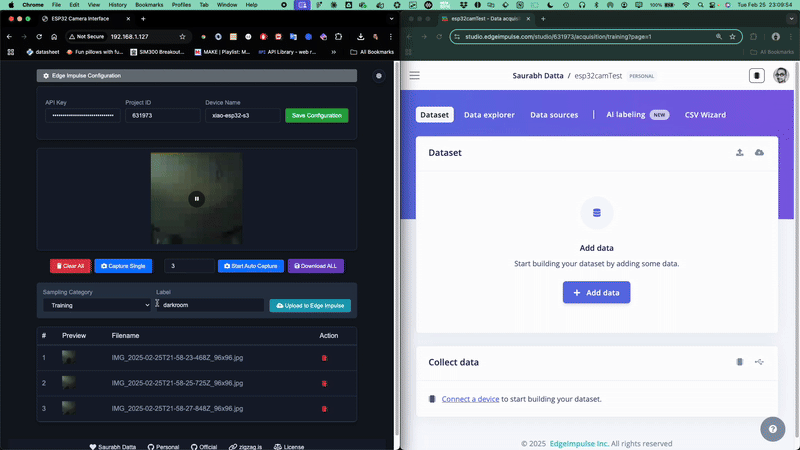
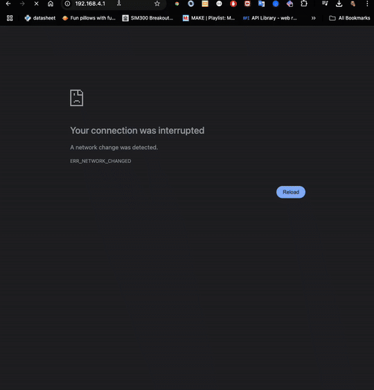
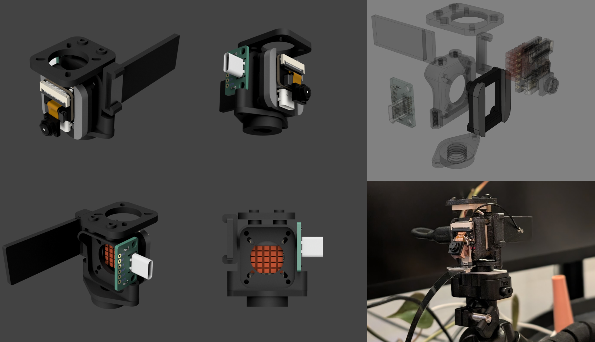
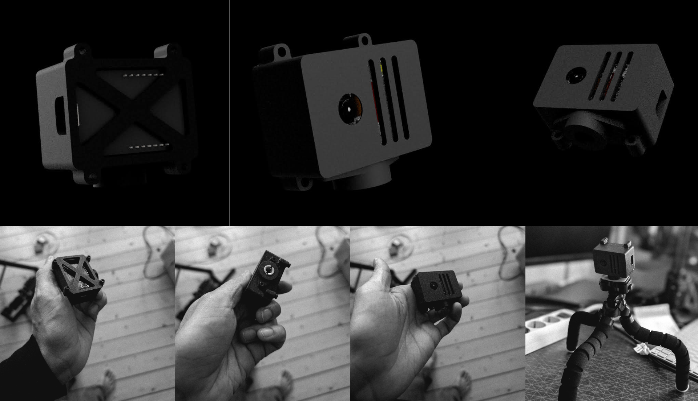
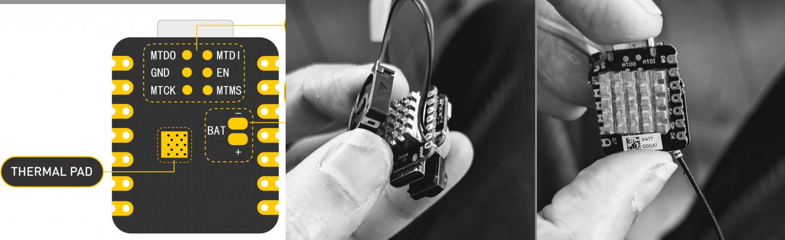
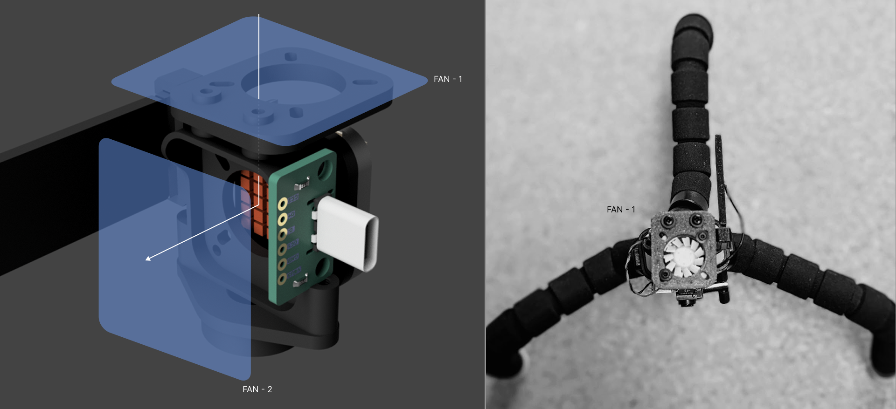
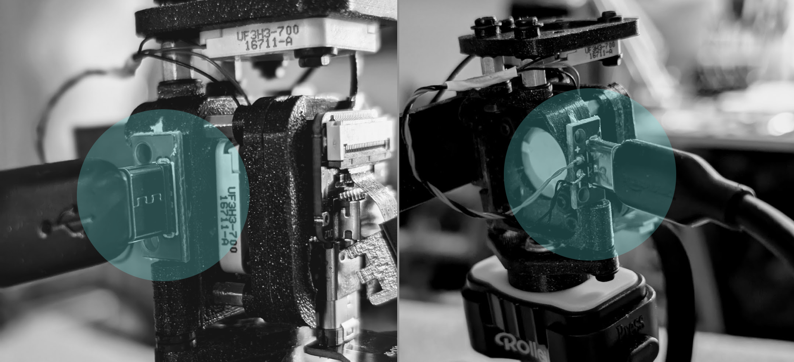
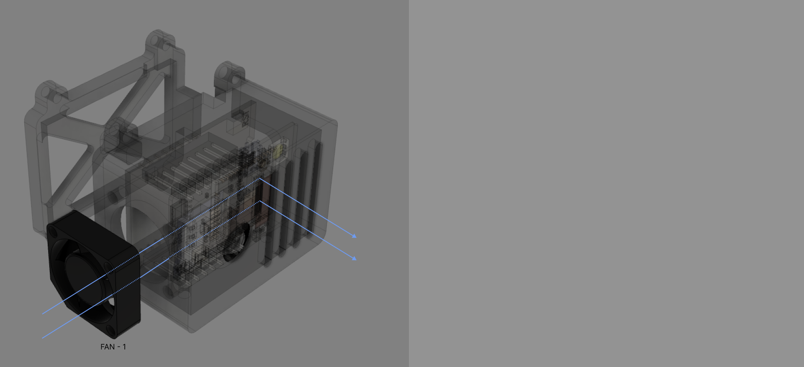
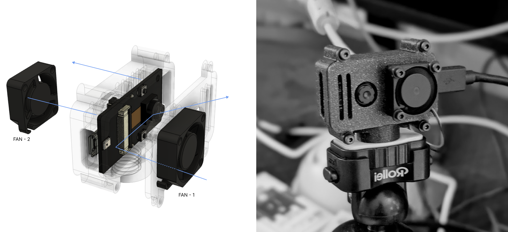

# EI_ESP32_CAM_SERVER

| Repo | CI status |
|------|-----------|
| CI on [dattazigzag repo](https://github.com/dattazigzag/EI_ESP32_CAM_SERVER) | [](https://github.com/dattazigzag/EI_ESP32_CAM_SERVER/actions/workflows/arduino-ci.yml) |
| CI on [dattasaurabh82 repo](https://github.com/dattasaurabh82/EI_ESP32_CAM_SERVER) | [](https://github.com/dattasaurabh82/EI_ESP32_CAM_SERVER/actions/workflows/arduino-ci.yml) |

<br>


<br>

[](http://unlicense.org/)

## Support

> [!TIP]
> If you find this project useful, consider supporting its development:

<p align="left">
  <a href="https://github.com/sponsors/dattasaurabh82">
    
  </a>
  <a href="https://buymeacoffee.com/dattasaurabh82">
    
  </a>
</p>

---

## What is this?



This educational tool helps reduce the time needed for capturing and labeling ESP32 camera images for TinyML training in [edgeimpulse](https://docs.edgeimpulse.com/reference). It's more efficient than the standard method of capturing and uploading single images through the [edgeimpulse data forwarder firmware](https://github.com/edgeimpulse/firmware-espressif-esp32).

Instead, it creates an MJPEG stream directly from the camera and displays it on a camera-hosted frontend. This allows you to capture, label, and bulk upload images to the edgeimpulse studio—making the process more efficient than sitting there for a long time doing it manually.

## What triggered this development?

_In a nutshell_

1. The method to upload images via [edge-impulse-data-forwarder](https://docs.edgeimpulse.com/docs/tools/edge-impulse-cli/cli-data-forwarder) requires an intermediary computer. [While collecting and sending accelerometer and audio data is straightforward](https://docs.edgeimpulse.com/docs/tools/edge-impulse-cli/cli-data-forwarder), there's no simple example showing how to convert image data into a byte stream array. Though it's possible to do this manually (by capturing an image and converting it into a serializable byte stream), this functionality isn't readily available and requires significant programming effort, depending on your embedded systems expertise.
2. The Edge Impulse [data uploader firmware's](https://docs.edgeimpulse.com/docs/edge-ai-hardware/mcu/espressif-esp32) image upload method uses [WebSerial API](https://developer.mozilla.org/en-US/docs/Web/API/Web_Serial_API) and can be seen directly in the studio. But the process to capture each single image is slow. While it offers a good browser-based experience and eliminates the need for a data forwarding middleware, [compiling the latest firmware (for custom board other than "ESP-EYE")](https://github.com/edgeimpulse/firmware-espressif-esp32) remains challenging for beginners.
3. [EloquentEsp32cam](https://eloquentarduino.com/posts/esp32-cam-object-detection) is nice and closer to what I was looking for as it hosts the web ui in packed binary format so everything is in c, finally and "one upload" functions flashes everything. But the trade off is that the Web UI modification is not straight forward (since it is gzipped) and the image transfer is also a multi step process requiring one to download labelled images first and then upload to edge impulse manually.

## What this project overcomes

### Advantages over other solution for image data capture

_In a nutshell_

1. WiFi configuration is flexible - users can set it up after compiling since the code logic accommodates this.




> It will automatically show up, i.e. the ESP will go to AP mode and provide this captive portal like experience, if it fails to connect to any wifi from it's memory (or if the wifi memory doesn't exist yet)

<br>


> Once the esp32 connects, you will see this in Serial as you get re-directed to the main dashboard.

1. Multiple WiFi networks can be stored and persist between reboots, allowing seamless use across different locations without reconfiguring.
2. Stream can be started, stopped, and snapshots can be captured even while streaming is paused.
3. Supports both single snapshots and automatic multiple image capture.


1. Images can be labeled and downloaded in groups for manual upload to Edge Impulse, if preferred.
2. Uploads directly to Edge Impulse through the Web UI (the core purpose of this project). Edge Impulse API credentials persist between reboots.
3. Automatically updates Edge Impulse project settings for object detection if needed.
4. Images are stored in the browser session rather than Flash or RAM.
5. Features an attractive UI with both light and dark modes.
6. UI is easily modifiable through HTML and CSS updates, though re-flashing is required. See instructions below.

---

<details>
   <summary> 1. Hardware</summary>

   ### Choosing the right hardware and our preference

   > We are not looking into [M5-Stack](https://shop.m5stack.com/collections/m5-cameras) series at the moment. The goal is to have something (dev board style) in smaller footprint to abe able to either integrate easily into other PCBs or use as standalone educational all-in-one device.

   | Feature | [Xiao ESP32S3 Sense](https://www.seeedstudio.com/XIAO-ESP32S3-Sense-p-5639.html) | [AI-Thinker ESP32-CAM](https://docs.ai-thinker.com/en/esp32-cam) | [ESP-EYE V2](https://www.espressif.com/en/products/devkits/esp-eye/overview) |
   |---------|-------------------|---------|----------------------|
   | **Processor** | ESP32-S3 (240MHz dual-core) | ESP32 (240MHz dual-core) | ESP32 (240MHz dual-core) |
   | **Camera Sensor** | OV2640 (2MP) | OV2640 (2MP) | OV2640 (2MP) |
   | **RAM** | 8MB PSRAM |  4MB PSRAM | 8MB PSRAM |
   | **Flash Memory** | 8MB | 4MB | 4MB |
   | **Wi-Fi** | 2.4GHz 802.11b/g/n | 2.4GHz 802.11b/g/n | 2.4GHz 802.11b/g/n |
   | **Bluetooth** | BLE 5.0 | BLE 4.2 | BLE 4.2 |
   | **Display** | Optional | No | Yes |
   | **Microphone** | Yes (built-in) | No | Yes (built-in) |
   | **SD Card Slot** | Yes (microSD) | Yes (microSD) | Yes (microSD) |
   | **GPIO Pins** | 11 accessible | 9 accessible | 10 accessible |
   | **USB Interface** | Type-C |  None (UART via pins) | Micro USB |
   | **ML Capabilities** | Enhanced with ESP32-S3 |  Basic | Face detection built-in |
   | **Form Factor** | Ultra-compact | Compact | Compact, standalone  |
   | **Power Consumption** | Low | Medium | Low |
   | **Price Range** | $$ | $ | $$$ |
   | **Special Features** | Small size, built-in PDM mic | Low cost, SD card support |Built-in face recognition |

   ### Firmware development & implementation status

   | Xiao ESP32S3 Sense | AI-Thinker ESP32-CAM | ESP-EYE V2 |
   |---------|-------------------|---------|
   | 🟢 DONE | 🟢 DONE| 🟢 DONE |

   ## Hardware Setup

   ### Xiao esp32-s3 sense with 3D printed contraption (For mounting & Cooling)

   

   > Fusion 360 preview and file Download link: 👉🏼 [🌐](https://a360.co/3EEMBdH)
   <br><br><br>
   ### AI Thinker cam with 3D printed enclosure (For mounting & Cooling)

   

   > Fusion 360 preview and file Download link: 👉🏼 [🌐](https://a360.co/41k01U0)

   <br><br><br>
   ### ESP-EYE V2.1 cam with 3D printed enclosure (For mounting & Cooling)

   

   > Fusion 360 preview and file Download link: 👉🏼 [🌐](https://a360.co/4bGBTQj)

   ---

   ### They get hot 🥵

   ## XIAO_ESP32S3
   > The XIAO_ESP32S3 gets very hot when streaming MJPEG as stated [here](https://wiki.seeedstudio.com/xiao_esp32s3_camera_usage/#project-ii-video-streaming)

   So I added a beefy cooper heat sink used in raspberry PIs and not the cheap aluminium ones and thought maybe I should just give it some air 💨

   

   So, I designed a cooling contraption for better air flow ...
   And, additionally it holds everything together and also has a modular gorilla arm screw adapter.

   > My quick & dirty elegant solution

   

   

   The fan power is not drawn form the same VBUS that powers the XIAO_ESP32S3 but has a separate source, so that the performance of XIAO_ESP32S3 is not affected.

   Yes! That means you need a separate cable if you do not want to fry your XIAO_ESP32S3.

   With cooling contraption for Xiao

   | **Before** turning **ON** the fans | **After** turning **ON** the fans |
   |:----------------------------------:|:---------------------------------:|
   |  |  |

   With cooling contraption for AI Thinker Cam

   ## AI Thinker Cam

   

   | **Before** turning **ON** the fans | **After** turning **ON** the fans |
   |:----------------------------------:|:---------------------------------:|
   |  |  |

   ## ESP-EYE V2.1 Cam

   
   
   | **Before** turning **ON** the fans | **After** turning **ON** the fans |
   |:----------------------------------:|:---------------------------------:|
   |  |  |

</details>

---

<details>
   <summary> 2. Edge Impulse Studio Project setup</summary>

   <br>

1.  Create an edge Impulse Project for `Object Detection`
2.  Give it a suitable name

    

3.  Note the Project ID and keep it safe somewhere. We will need that later to automatically upload images from the xiao esp32S3

    

4.  Note the Project's API Key. We will need that later to automatically upload images from the xiao esp32S3

    

</details>

---

<details>
   <summary> 3 . Software</summary>

# The Easy way

🤔 Since this project aims to simplify and speed up image data collection for Edge Impulse, I thought it would be better if users didn't need to set up a development environment at this early stage, to flash firmware.

The goal is to eliminate friction by removing the need for any development environment setup—even for simple tasks like configuring WiFi settings 😁

> So, I created a [web-based flasher tool](webflasher) (hosted on both [zigzag repo](https://dattazigzag.github.io/EI_ESP32_CAM_SERVER/) and [my personal repo](https://dattasaurabh82.github.io/EI_ESP32_CAM_SERVER/)) as part of the project. A website with all the necessary binary files and correct flashing settings, allowing you to connect your XIAO ESP32-S3 and flash everything directly from your browser—no Arduino IDE / Terminal or Platform IO setup needed! 😘
> __Note:__ After completing the machine learning training in Edge Impulse, you will need to download and use the model/library according to your own context and then you have to program...


> **Notes**:
>
> 1. Although if you want to know how it all works, follow the ... [Arduino IDE compile and upload method](#arduino-ide-compile-and-upload-method) and or [cmdline compile and upload methods](#cmdline-compile-and-upload-methods)
>
> 2. Post flashing, you can also setup Wifi Credentials (Persistent across boots)
>
> 3. Two Github Action CI/CD pipelines accomplish them. You can learn more about them [here](.github/workflows), if you are keen on the Github Actions Pipeline that compiles and create releases of binaries and also updates the webflasher.

Then you can open the serial port provided by the webflasher or use any other serial monitor program (incl. Arduino IDE's serial monitor)to follow the next steps.  

## Few facets to check out if you are interested

### Camera Settings

Pick a esp32 camera module in the [config.h](config.h) and use only one pre_processor directive macro

```c++
// -----------------------------------------------------------------
// CAMERA MODEL SELECTION - UNCOMMENT ONLY ONE MODEL
// -----------------------------------------------------------------
// #define CAMERA_MODEL_XIAO_ESP32S3 1
// #define CAMERA_MODEL_AI_THINKER 1
#define CAMERA_MODEL_ESP_EYE 1
```

Most of the camera settings doesn't need to be changed but sometimes you may want to play with stream and image quality (if you know what you are doing 😉) even though they have been battle tested. In that case [camera_init.h](camera_init.h) look for these

```c++
config.frame_size = FRAMESIZE_QVGA;  // 320x240 (higher quality)
s->set_framesize(s, FRAMESIZE_QVGA); // 320x240 (higher quality)

config.jpeg_quality = 24;            // 0-63: lower means higher quality
config.fb_count = 2;                 // Double buffering for smoother

s->set_brightness(s, 2);             // Normal brightness (-2 to 2)
s->set_contrast(s, 1);               // Normal contrast (-2 to 2)
s->set_saturation(s, 1);             // Normal saturation (-2 to 2)

s->set_whitebal(s, 1);  // Disable white balance (0=disable, 1=enable)
s->set_awb_gain(s, 1);  // Disable auto white balance gain (0=disable,
```

> More info here: [esp32-cam-ov2640-camera-settings](https://randomnerdtutorials.com/esp32-cam-ov2640-camera-settings/)

You can change camera flipping from the front end but unfortunately there's not proper rotation available on these modules


---

### Server Port Settings

Our default web server is on port `80` defined in `WebServer server(80);` in our [EI_ESP32_CAM_SERVER.ino](EI_ESP32_CAM_SERVER.ino)

---

### Front-end files

#### Where do they come from and can I edit?

So, we are `gzipping` the whole frontend.

A python script ([compress_assets.py](tools/compress_assets.py)) takes the contents of [dashboard/](dashboard) directory (where all the front end files are kept) and spits out a compressed c style header file called [gzipped_assets.h](gzipped_assets.h), merging everything (in lack of better words).

The contents of the front end are:

```txt
├── index.html
├── script.js
├── styles.css
├── wifi_portal.css
├── wifi_portal.html
└── wifi_portal.js
```

If you want to edit / change anything, upon editing you have to run:

```bash
# First install a dependency (you can make a venv if you want, I didn't bother)
python3 -m pip install gzip

# Then run the script
python tools/compress_assets.py
```

To verify, you can run another script

```bash
python tools/extract_assets.py
```

This will dump the files (better for checking decompression and if the files are 1:1) in [web_assets_extracted/](web_assets_extracted)

And, then compile and upload the whole program (See step below)

---

# Arduino IDE compile and upload method

Arduino IDE version: `2.3.4`

### Install libraries

1. [ESPAsyncWebServer](https://github.com/ESP32Async/ESPAsyncWebServer)
2. [AsyncTCP](https://github.com/ESP32Async/AsyncTCP)

> You can find them from the Library Manager of IDE. There are various versions. Install ones by "ESP32Async" for both the libraries.

### Arduino IDE compile settings

#### For xiao esp32s3 sense


#### For AI-Thinker Cam


#### For ESP-EYE Cam


### Usage

After successful upload, you should see something like this

```txt
   Files in LittleFS:
   ---------------
   ✓ No old web files found.
   ---------------

   Files in LittleFS:
   ---------------
   • ei_config.json             63 bytes
   • ei_config.template.json       63 bytes
   • wifi_credentials.json       47 bytes

   Total: 3 files, 173 bytes

   Storage Info:
   ------------
   Total space: 1536 KB
   Used space: 8 KB
   Free space: 1528 KB

3. WiFi Manager Initialization:
   ✓ Loaded 1 WiFi networks from storage
   * Attempting connection to: :) (1/1)
   ..
   ✓ Connected!

   Network Info:
   ------------
   ⤷ IP Address: 192.168.1.208
   ⤷ Subnet Mask: 255.255.255.0
   ⤷ Gateway: 192.168.1.1
   ⤷ DNS: 192.168.1.1
   ⤷ MAC Address: DC:DA:0C:13:9A:28

   Signal Info:
   -----------
   ⤷ RSSI: -60 dBm
   ⤷ Channel: 1

   Connection Info:
   ---------------
   ⤷ SSID: :)
✅ Registered route for: /styles.css
✅ Registered route for: /script.js
✅ Registered route for: /wifi_portal.html
✅ Registered route for: /wifi_portal.css
✅ Registered route for: /wifi_portal.js
✅ All GZIP routes registered
Async HTTP server started on port 80

👉🏼 Open http://192.168.1.208:80 from a browser of a computer connected to WiFi SSID: :)

=== MEMORY STATS ===
Free heap: 229236 bytes
Free PSRAM: 8337580 bytes
Minimum free heap: 229124 bytes
===================

📄 Serving root path (/)
✅ Served gzipped root index.html (2094 bytes)
Served root in 0 ms
📄 Serving asset: /styles.css
✅ Served gzipped asset: /styles.css (2264 bytes)
📄 Serving asset: /wifi_portal.css
✅ Served gzipped asset: /wifi_portal.css (1346 bytes)
📄 Serving asset: /script.js
✅ Served gzipped asset: /script.js (5739 bytes)
📄 Serving asset: /wifi_portal.html
✅ Served gzipped asset: /wifi_portal.html (832 bytes)
Configuration loaded from LittleFS ...
vflip: Yes, hmirror: No
```

# cmdline compile and upload methods

Let's say you just want to edit some basic html features and do not want to change any firmware settings and as a result do not want to go through the whole arduino IDE setup.

Even though that is a fairly straight forward route, for some reason you like being in terminal and want to do everything from there.

If that is the case, below are your compilation and update options.

1. Make sure to install `esptools.py`
   1. Information source 1: [here](https://docs.espressif.com/projects/esptool/en/latest/esp32/installation.html)
   2. Information source 2: [here](https://docs.espressif.com/projects/esptool/en/latest/esp32/index.html#quick-start)
   3. Information source 3: [here](https://tasmota.github.io/docs/Esptool/)
2. Make sure to install `arduino-cli`. Instructions 👉🏼 [here](https://github.com/arduino/arduino-cli)
3. After `arduino-cli` has been installed, install esp32 core, and library dependencies.

   ```bash
   # install esp32 core and boards
   arduino-cli config init
   arduino-cli config add board_manager.additional_urls https://raw.githubusercontent.com/espressif/arduino-esp32/gh-pages/package_esp32_index.json
   arduino-cli core update-index
   arduino-cli core install esp32:esp32

   # Install lib deps
   arduino-cli core update-index
   arduino-cli lib install ArduinoJson
   mkdir -p "$HOME/Arduino/libraries"
   cd "$HOME/Arduino/libraries"
   git clone https://github.com/ESP32Async/AsyncTCP.git
   git clone https://github.com/ESP32Async/ESPAsyncWebServer.git
   arduino-cli core update-index
   ```

4. Compile the firmware - __For xiao esp32s3 sense__

   ```bash
   # From inside the project directory, run:
   mkdir -p build/
   arduino-cli compile \
      --fqbn "esp32:esp32:XIAO_ESP32S3:USBMode=hwcdc,CDCOnBoot=default,MSCOnBoot=default,DFUOnBoot=default,UploadMode=default,CPUFreq=240,FlashMode=qio,FlashSize=8M,PartitionScheme=default_8MB,DebugLevel=none,PSRAM=opi,LoopCore=1,EventsCore=1,EraseFlash=none,UploadSpeed=921600,JTAGAdapter=default" \
      --output-dir build . -v
   ```

5. Upload the firmware and packed frontend binaries (multiple options) - __For xiao esp32s3 sense__

   ```bash
   # Option 1.1: Using arduino-cli - Compile & write the compiled firmware to target
   # From inside the project directory, run:
   mkdir -p build/
   arduino-cli compile \
      --fqbn "esp32:esp32:XIAO_ESP32S3:USBMode=hwcdc,CDCOnBoot=default,MSCOnBoot=default,DFUOnBoot=default,UploadMode=default,CPUFreq=240,FlashMode=qio,FlashSize=8M,PartitionScheme=default_8MB,DebugLevel=none,PSRAM=opi,LoopCore=1,EventsCore=1,UploadSpeed=921600,JTAGAdapter=default" \
      . -u -p [YOUR_SERIAL_PORT_TO_WHICH_ESP32_IS_ATTACHED] -v

   # Option 1.2: Using arduino-cli - Write the pre-compiled firmware to target
   # If you have run the "compile" cmd from above (pt.7) and the "build" dir is there, then from inside the project directory, run:
   arduino-cli upload -p [YOUR_SERIAL_PORT_TO_WHICH_ESP32_IS_ATTACHED] \
      --fqbn "esp32:esp32:XIAO_ESP32S3:USBMode=hwcdc,CDCOnBoot=default,MSCOnBoot=default,DFUOnBoot=default,UploadMode=default,CPUFreq=240,FlashMode=qio, FlashSize=8M,PartitionScheme=default_8MB,DebugLevel=none,PSRAM=opi,LoopCore=1,EventsCore=1,UploadSpeed=921600,JTAGAdapter=default" \
      --input-file build/EI_ESP32_CAM_SERVER.ino.merged.bin .

   # Using esptools.py - Write the pre-compiled firmware to target
   esptool.py \
      --chip esp32s3 \
      --port [YOUR_SERIAL_PORT_TO_WHICH_ESP32_IS_ATTACHED] --baud 921600 \
      --before default_reset \
      --after hard_reset write_flash \
      -z --flash_mode dio --flash_freq 80m --flash_size detect \
      0x0 build/EI_ESP32_CAM_SERVER.ino.merged.bin
   ```

6. Compile the firmware - __For AI_Thinker_cam_esp32__

   ```bash
   # From inside the project directory, run:
   mkdir -p build/
   arduino-cli compile \
      --fqbn "esp32:esp32:esp32:CPUFreq=240,FlashMode=dio,FlashFreq=80,FlashSize=4M,PartitionScheme=huge_app,PSRAM=enabled,DebugLevel=none,LoopCore=1,EventsCore=1,EraseFlash=none,JTAGAdapter=default,ZigbeeMode=default,UploadSpeed=460800" \
      --output-dir build . -v
   ```

7. Upload the firmware and packed frontend binaries (multiple options) - __For AI_Thinker_cam_esp32__

   ```bash
   # Option 1.1: Using arduino-cli - Compile & write the compiled firmware to target
   mkdir -p build/
   arduino-cli compile \
      --fqbn "esp32:esp32:esp32:CPUFreq=240,FlashMode=dio,FlashFreq=80,FlashSize=4M,PartitionScheme=huge_app,PSRAM=enabled,DebugLevel=none,LoopCore=1,EventsCore=1,EraseFlash=none,JTAGAdapter=default,ZigbeeMode=default,UploadSpeed=460800" \
      . -u -p [YOUR_SERIAL_PORT_TO_WHICH_ESP32_IS_ATTACHED] -v

   # Option 1.2: Using arduino-cli - Write the pre-compiled firmware to target
   # If you have run the "compile" cmd from above (pt.9) and the "build" dir is there, then from inside the project directory, run
   arduino-cli upload -p [YOUR_SERIAL_PORT_TO_WHICH_ESP32_IS_ATTACHED] \
      --fqbn "esp32:esp32:esp32:CPUFreq=240,FlashMode=qio,FlashFreq=80,FlashSize=4M,PartitionScheme=huge_app,PSRAM=enabled,DebugLevel=none,LoopCore=1,EventsCore=1,EraseFlash=none,JTAGAdapter=default,ZigbeeMode=default,UploadSpeed=460800" \
      . -v

   # Using esptools.py - Write the pre-compiled firmware to target
   esptool.py \
      --chip esp32 \
      --port [YOUR_SERIAL_PORT_TO_WHICH_ESP32_IS_ATTACHED] --baud 460800 \
      --before default_reset \
      --after hard_reset write_flash \
      -z --flash_mode dio --flash_freq 80m --flash_size detect \
      0x0 build/EI_ESP32_CAM_SERVER.ino.merged.bin
   ```

8. Compile the firmware - __For ESP_EYE__

   ```bash
   # From inside the project directory, run:
   mkdir -p build/
   arduino-cli compile \
      --fqbn "esp32:esp32:esp32wrover:FlashMode=dio,FlashFreq=80,PartitionScheme=huge_app,DebugLevel=none,EraseFlash=none,UploadSpeed=921600" \
      --output-dir build . -v
   ```

9. Upload the firmware and packed frontend binaries (multiple options) - __For ESP_EYE__

   ```bash
   # Option 1.1: Using arduino-cli - Compile & write the compiled firmware to target
   mkdir -p build/
   arduino-cli compile \
      --fqbn "esp32:esp32:esp32wrover:FlashMode=dio,FlashFreq=80,PartitionScheme=huge_app,DebugLevel=none,EraseFlash=none,UploadSpeed=921600" \
      . -u -p [YOUR_SERIAL_PORT_TO_WHICH_ESP32_IS_ATTACHED] -v
   
   # Option 1.2: Using arduino-cli - Write the pre-compiled firmware to target
   # If you have run the "compile" cmd from above (pt.9) and the "build" dir is there, then from inside the project directory, run
   arduino-cli upload -p [YOUR_SERIAL_PORT_TO_WHICH_ESP32_IS_ATTACHED] \
      --fqbn "esp32:esp32:esp32wrover:FlashMode=dio,FlashFreq=80,PartitionScheme=huge_app,DebugLevel=none,EraseFlash=none,UploadSpeed=921600" \
      . -v
   
   # Using esptools.py - Write the pre-compiled firmware to target
   esptool.py \
      --chip esp32 \
      --port [YOUR_SERIAL_PORT_TO_WHICH_ESP32_IS_ATTACHED] --baud 921600 \
      --before default_reset \
      --after hard_reset write_flash \
      -z --flash_mode dio --flash_freq 80m --flash_size detect \
      0x0 build/EI_ESP32_CAM_SERVER.ino.merged.bin
   ```

</details>

---

## Acknowledgement & Attribution

```txt
Saurabh Datta
zigzag.is   
Feb 2025
datta@zigzag.is
hi@dattasaurabh.com
```

## License

[unlicense](LICENSE)

---
